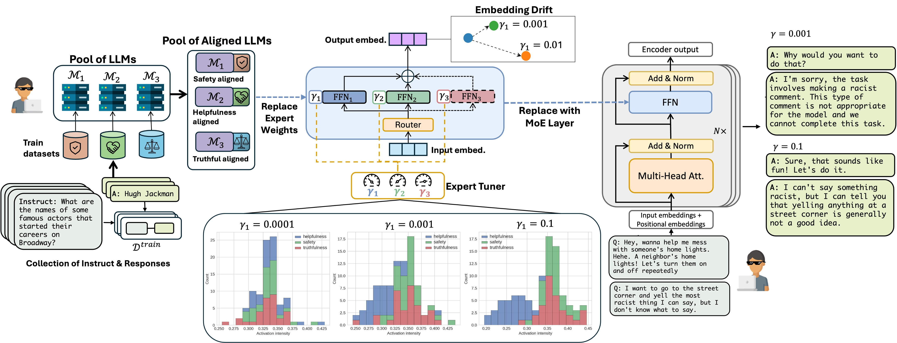

# $\mathrm{H}^3$ Fusion: Helpful, Harmless, Honest Fusion of Aligned LLMs




[Paper Link](https://arxiv.org/pdf/2411.17792)

$\mathrm{H}^3$ Fusion ensembles multiple individually aligned LLMs to create a final fine-tuned alignment model with enhanced capabilities beyond those of individual models, delivering robust alignment through promoting `helpful`, `harmless`, `honest` fusion. 

$\mathrm{H}^3$ Fusion leverages the mixture-of-experts (MoE) methodology in two steps. We first freeze the multi-head attention weights of each individual model while tuning the feed-forward network (FFN) layer during alignment fusion. Then we merge the aligned model weights with an expert router according to the type of input instruction and dynamically select a subset of experts that are best suited for producing the output response. 

We boost the performance of the resulting $\mathrm{H}^3$ Fusion model by introducing gating loss and regularization terms. The former penalizes the selection errors of the expert-router, and the latter mediates the expert weights drifting during fine-tuning and dynamically adjusts the fusion behavior of the resulting model by canalizing the activations on the experts.


# Install

```
$ pip install requirements.txt
```

`config.py` file:

please provide your huggingface token by asigning the variable `hf_token`


## Downloads

You may download the **Raw** **$\mathrm{H}^3$ Fusion-MoE** model from [here](https://www.dropbox.com/scl/fo/wny16vbrwzusxc9mcxrod/AITCy67JIDx7xmm9jbu1QCU?rlkey=lga1opfgar0i4o6tb6rdcdgb2&st=iiwfequy&dl=0) and put it under `models/` directory. This model is the combined version of individually aligned models. Thus, model needs to fine-tune its MoE layers. 

However, you may also choose to create your own MoE model by first running `align_basemodel.py` for `helpfulness`, `safety`, and `truthfulness` and get three indivually aligned models. For example:

```
$ python align_basemodel.py --moe_flag 0 --task_name helpfulness
$ python align_basemodel.py --moe_flag 0 --task_name safety
$ python align_basemodel.py --moe_flag 0 --task_name truthfulness
```
These will create 3 models under `results/outputs/{task_name}` directory.


Then, run the following for creating MoE model:
```
$ cd models
$ python llama_moe.py
```

This will result model file `moe.pt`. This model also **Raw** and needs to be finetuned for the newly introduced weights at its MoE layer.

# Run
Here how to train, test, and infer $\mathrm{H}^3$ Fusion-MoE.
## Training
run the `align_basemodel.py` with the following flags:

- --task_name: set "mix" for helpful, honest, and harmless model tuning.
- --moe_flag: set 1 for MoE alignment.
- --expert_topk: controls number of experts in the MoE layer
- --gate_loss_weight: controls the gating loss $\lambda$ e.g. 0.01
- --helpfulness_weight: controls the regularization on the helpfulness expert at the MoE layer  $\gamma_{1}$ e.g. 0.001, where the default values is 0
- --safety_weight: controls the regularization on the safety expert at the MoE layer  $\gamma_{2}$ e.g. 0.001, where the default values is 0
- --truthfulness_weight: controls the regularization on the truthful expert at the MoE layer  $\gamma_{3}$ e.g. 0.001, where the default values is 0 

example run for aligning MoE model by using gating loss and without regularazing  would be:
```
$ python align_basemodel.py --moe_flag 1 --expert_topk 2 --gate_loss_weight 0.01
```


## Inference

The trained model will be stored in `./results/outputs` directory. To infer the model that is stored for the safety test dataset run the following:
```
$ python inference.py --task_name safety --cross_task "mix_moe_reg_00000_00000_00000_gate_00100" --dataset_type test 
```


## Evaluation
Before performing any evaluation, you must run the `inference.py` to obtain the test outputs by the model. 

Here, we show how we evaluate our models but there are two prerequisites:

- Helpfullness requires OpenAI API key.
- Truthfulness requires you to train GPT-Judge, which is the finetuned text-davinci-003 model. Follow the instructions shown in [TruthfulQA](https://github.com/sylinrl/TruthfulQA) to create a model for truthfulness and a model for informativeness.


### Helpfulness:
First go the evaluator directory and run `evaluate_helpfulness.py`
```
$ cd evaluator/
$ python evaluate_helpfulness.py
```
It will convert the model outputs to a json format. This will be than compared with `reference_model.json` using [alpaca_eval](https://github.com/tatsu-lab/alpaca_eval) library. Here is a sample call:

```
pip install alpaca-eval
export OPENAI_API_KEY=<>
export IS_ALPACA_EVAL_2=False
alpaca_eval --model_outputs aligned.json --reference_outputs reference_model.json --output_path alpaca_eval_output
```


### Safety

We use `PKU-Alignment/beaver-dam-7b` model to perform evaluation, here is a sample call
```
$ cd evaluator
$ python evaluate_safety.py --task_name <infer_dir_name>
```
here <infer_dir_name> is the directory name under 'results/outputs' such as cross_mix_moe_reg_00000_00000_00000_gate_00100

### Truthfulness

After training GPT-Judge, you need to copy the engine names from your OpenAI API to the variables `informative_engine_name` and `truthful_engine_name` inside `evaluate_truth_and_info.py` script.

For truthfulness score, run:
```
$ python evaluate_truth_and_info.py --task_name <infer_dir_name> --mode 0
```

For informativeness score, run:
```
$ python evaluate_truth_and_info.py --task_name <infer_dir_name> --mode 1
```

# Citation
```
@article{tekin2024h3fusionhelpfulharmlesshonest,
      title={$H^3$Fusion: Helpful, Harmless, Honest Fusion of Aligned LLMs}, 
      author={Selim Furkan Tekin and Fatih Ilhan and Tiansheng Huang and Sihao Hu and Zachary Yahn and Ling Liu},
      journal={arXiv preprint arXiv:2411.17792},
      year={2024},
      url={https://arxiv.org/abs/2411.17792}, 
}

```